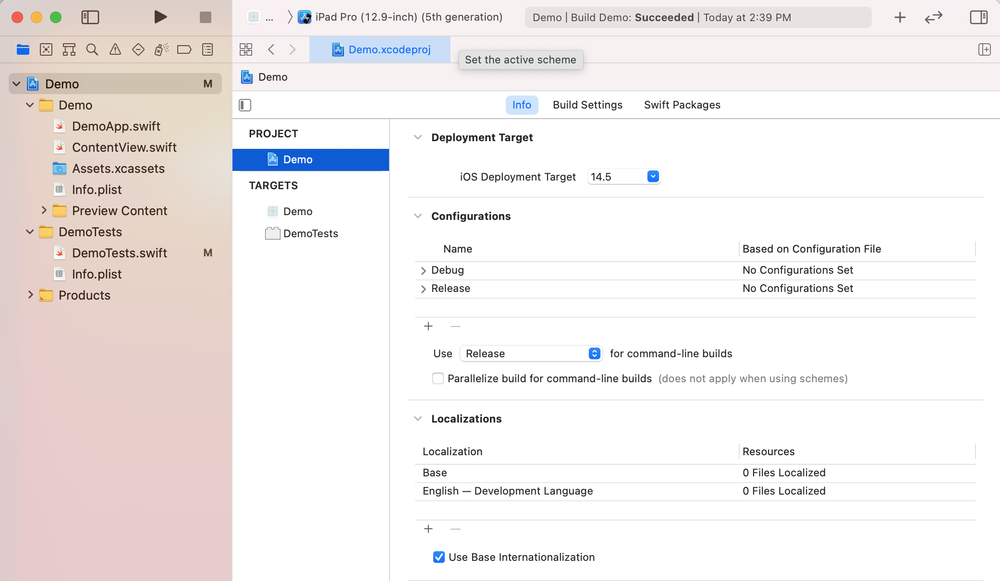
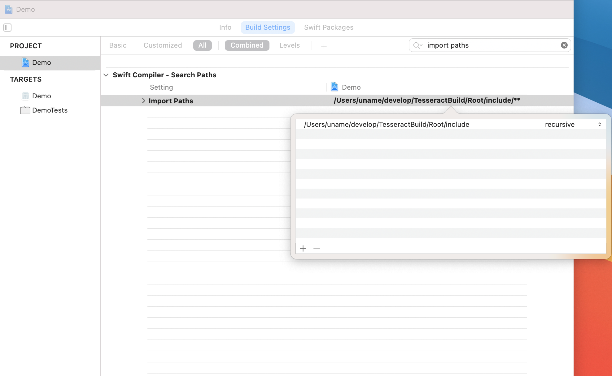
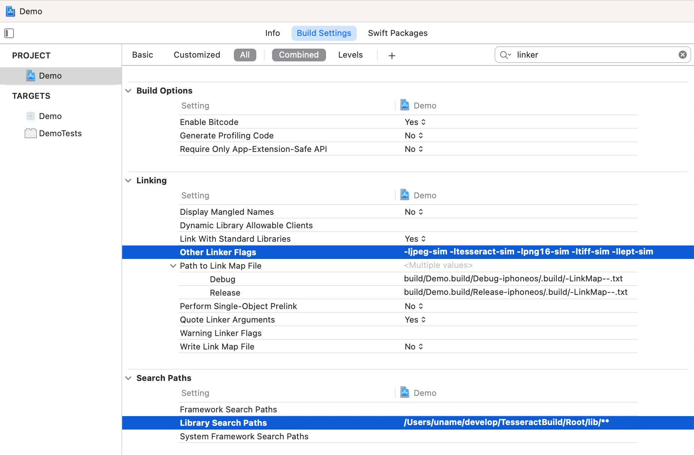
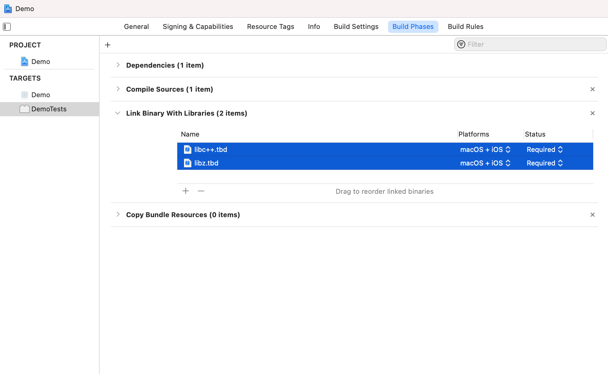
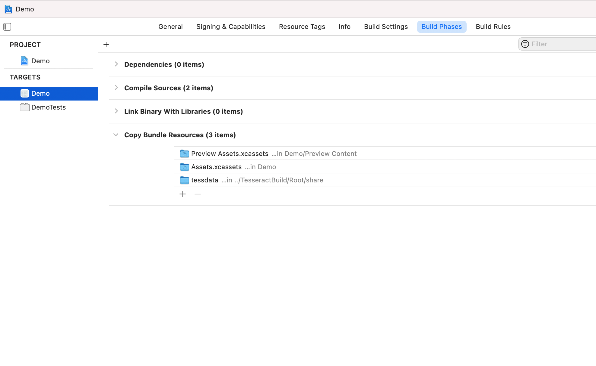
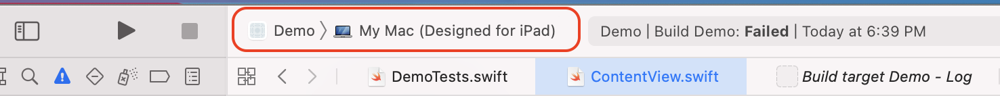
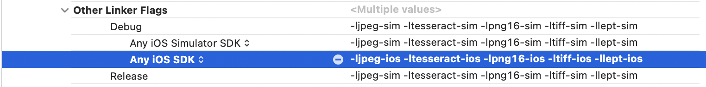
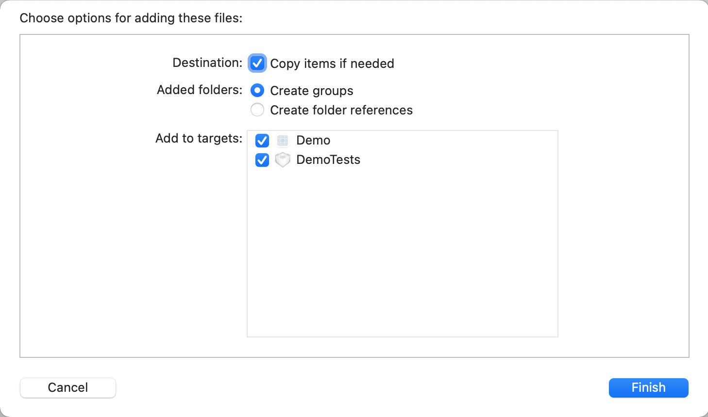
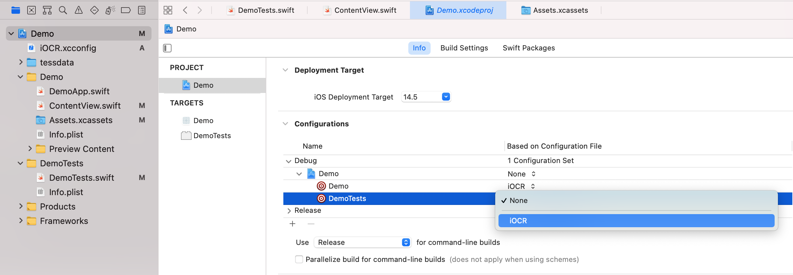

<!-- markdownlint-disable-file MD033 -->
# Using the C/C++ libs in Xcode

## Overview

After finally getting the OCR C++ libraries built, I had another set of
challenges adding and using them in our sample Xcode project.  This is written
from my perspective and shows my progression as I worked through specific
errors.

The high points of using the Leptonica and Tesseract libraries are telling Xcode
where to find headers for the libs (modules), to build with the libs, where to
find the libs, building with some other standard libs, and finally bundling the
Tesseract language data for the app at run-time:

1. find the header files for our built libraries (modules) with `SWIFT_INCLUDE_PATHS`
1. link with our built libraries using `OTHER_LDFLAGS`
1. find our built libraries with `LIBRARY_SEARCH_PATHS`
1. link with zlib and libc++
1. add/bundle tessdata language files

I think a straightforward way to show how each of these steps contributes to the
overall project (their cause and effect) is to create a new project from scratch
with a test-image to perform OCR on. We'll then follow my naive approach of
trying to run the test, get an error, fix the error, and repeat till it finally
builds and successfully completes the test.

The first four configuration steps encompass build errors, the last step got me
past a run-time error.

## Create the project and a small test

I'm starting with an empty project for an iOS app that includes a test:

1. **File** &rarr; **New** &rarr; **Project..** (<kbd>&#x21e7; &#x2318; N</kbd>)
1. For the template, I went with the **iOS** platform and an **App** application
1. For the options, I went with:
    - **Product name:** Demo
    - **Interface:** SwiftUI
    - **Language:** Swift
    - [x] Include Tests

I named my project **Demo**, so some files and symbols in code that I'm
mentioning have that name.  I've also deleted the DemoUITests folder/group in
Project navigator, as well as the target from the project settings.

With the project open, I'm going to the DemoTests folder/group, opening
DemoTests.swift, and replacing the entire file with:

```swift
import XCTest
@testable import Demo

import libleptonica
import libtesseract

class DemoTests: XCTestCase {
    func testExample() throws {
        // UIImage to Leptonica Pix
        let imgData = UIImage(named: "test_jpn")!.pngData()! as NSData
        let rawPointer = imgData.bytes
        let uint8Pointer = rawPointer.assumingMemoryBound(to: UInt8.self)
        let image = pixReadMem(uint8Pointer, imgData.count)

        // Init Tesseract and recognize
        let tessAPI = TessBaseAPICreate()!
        let trainedDataFolder = Bundle.main.path(forResource: "tessdata", ofType: nil, inDirectory: ".")
        TessBaseAPIInit2(tessAPI, trainedDataFolder, "jpn", OEM_LSTM_ONLY)
        TessBaseAPISetImage2(tessAPI, image)
        TessBaseAPISetSourceResolution(tessAPI, 144)
        TessBaseAPISetPageSegMode(tessAPI, PSM_AUTO)
        TessBaseAPIRecognize(tessAPI, nil)

        // Get result and assert
        let iterator = TessBaseAPIGetIterator(tessAPI)
        let txt = TessResultIteratorGetUTF8Text(iterator, RIL_TEXTLINE)!
        XCTAssertEqual(String(cString:txt), "Hello, 世界\n")
    }
}
```

This test needs an image to perform OCR on, I'll add that to the project Assets
folder with the name **test_jpn**:

</img>

Looking at my entire project, and the project settings overview:

</img>

## Build errors

With the demo project set up and a test created, Xcode immediately lets me know that there's a problem.

### No such module

It cannot find the first external library from my two import statements:

> ❌ No such module 'libleptonica'

This sample repo already has a **modules.modulemap** file that declares *module*
names and the paths to the header files that make up each module.  I need to
tell Xcode where that file is.  In Xcode, these configuration options can be
found by (searching for) their UI-ish name, like 'Import Paths' or the
environment variable name that can be referenced by project scripts and other
variables, like 'SWIFT_INCLUDE_PATHS'.

In project settings:

1. Select **Build Settings** &rarr; **All**
1. Search for **Import Paths**/**SWIFT_INCLUDE_PATHS**
1. Expand the setting and copy-paste the path to this repo's Root/include folder for Debug and Release; for my setup, this looks like:

    > `/Users/uname/develop/TesseractBuild/Root/include/**`

    On my system, Xcode doesn't resolve `~` to my home directory, so I give it
    the full path.  The `**` at the end means "recursive" to Xcode (which you
    can see when you double-click the value and an extra dialog pops up, like in
    the screenshot below).

</img>

Clean the build folder, <kbd>&#x21e7; &#x2318; K</kbd>, and re-run the unit
test, <kbd>&#x2318; U</kbd>, and I've cleared this error.

### Undefined symbol

With the modules found, the compiler moves on trying to build my test, but hits
another wall.  The first thing I see is this error in the Issue navigator:

> ❌ Undefined symbol: _TessBaseAPICreate

Clicking on that I'm taken to the actual build-phase error, `Link DemoTests (arm64)`.
Jumping straight to the bottom I can see the final error message:

> ```none
> ...
> Undefined symbols for architecture arm64:
>   "_TessBaseAPICreate", referenced from:
>       DemoTests.DemoTests.testExample() throws -> () in DemoTests.o
>   "_TessBaseAPIInit2", referenced from:
>       DemoTests.DemoTests.testExample() throws -> () in DemoTests.o
> ld: symbol(s) not found for architecture arm64
> clang: error: linker command failed with exit code 1 (use -v to see invocation)
> ```

The compiler (**clang**) tries to compile the test file, sees that I'm calling
`TessBaseAPICreate()`, but cannot find that *symbol* in its available libraries.

To make the symbols from our libraries available, we need to *link* them with the
binary that clang is compiling. To do this, we need to tell clang two things:

- **`-l` options:** which libraries to link with
- **`-L` options:** where the object files for our libraries (**.a files** in
  our case) can be found

Going back Xcode I read down from the top of the error message and I can see two issues in
the command-line arguments to clang:

- there are no `-l` options, so it doesn't know about our libraries
- there are some `-L` options, but they point to Xcode/iOS/Swift libraries, so
  it doesn't know where to look for our libraries

In Xcode the `-l` options are configured with **Other Linker Flags**/**OTHER_LDFLAGS**.

I go back to project settings, search for either of those names, and copy-paste in this
string of values:

> `-ljpeg-sim -ltesseract-sim -lpng16-sim -ltiff-sim -llept-sim`

This repo's build process creates library files for the three current frameworks
in Xcode: iOS, macOS, and Simulator.  In Xcode, tests must be run on a *concrete
device*, so the libraries the test is compiled with must match the targeted
device type.  Since I'm running the test on the simulator, I chose the `-sim`
versions of our library files.  I'll cover configuring Xcode to work with all
frameworks at the end of this guide.

Now that the compiler knows which libraries to link with, I tell it where to
find them.

The `-L` options are configured with **Library SearchPaths**/**LIBRARY_SEARCH_PATHS**.

For my system, this looks like:

> `/Users/uname/develop/TesseractBuild/Root/lib/**`

You can also find both settings by searching for just "linker ":

</img>

Clean the build folder, <kbd>&#x21e7; &#x2318; K</kbd>, and re-run the unit
test, <kbd>&#x2318; U</kbd>, and I'm still getting an 'undefined symbol' error.

### More undefined symbols

Xcode is successfully finding and linking with the OCR libraries, but failing
when the linking process sees that our libraries depend on two other "system
libraries", **zlib** for image compression and **libc++** for anything C/C++
related.  zlib is explicitly defined in the two configuration scripts for
Leptonica and Tesseract for our build process with the `-lz` flag.  I assume
clang implicitly adds the linker flag for libc++.  Xcode provides these two
libraries, so I just have to add them to the project.

In project settings:

1. select **DemoTests** under **TARGETS**
1. select **Build Phases** and expand **Link Binary with Libraries**
1. click the **+** (plus-sign) button
1. search for and add, **libz.tbd** and **libc++.tbd**

</img>

Clean the build folder, <kbd>&#x21e7; &#x2318; K</kbd>, re-run the test,
<kbd>&#x2318; U</kbd>, and it builds! But then fails during the test.

## Run-time error

The test tries calling the Recognize function for the Tesseract API, but hits an unhandled exception:

> ❌ Thread 1: EXC_BAD_ACCESS (code=1, address=0xc)

Looking at the debug messages from lldb, I see:

> ```none
> Error opening data file /Users/uname/develop/TesseractBuild/Root/ios_arm64_sim/share/tessdata/jpn.traineddata
> Please make sure the TESSDATA_PREFIX environment variable is set to your "tessdata" directory.
> Failed loading language 'jpn'
> Tesseract couldn't load any languages!
> ```

I specified the `trainedDataFolder` in the test:

```swift
let trainedDataFolder = Bundle.main.path(forResource: "tessdata", ofType: nil, inDirectory: ".")
```

but haven't brought it into the project yet, and now the API appears to be
looking for the language data file where the library's .a file is located.  So
I'll add the folder as a reference to the project.

1. Right-click **Demo** at the top of Project navigator &rarr; **Add Files to "Demo"...**
1. Navigate to `TesseractBuild/Root/share`
1. Single-click **tessdata** &rarr; **Add** with the following options:
    - [x] Create folder references
    - **Add to targets:**
        - [x] Demo
        - [ ] DemoTests

<kbd>&#x2318; U</kbd>, and ✅, the test passes!

## Wrap-up

When I added the tessdata folder to the project, I intentionally left the
DemoTests target unchecked to show that the folder needs to just exist in the
project for Xcode to find and use it (for the test)&mdash;it doesn't need to be
a part of the build configuration.

But to do OCR in an app, the tessdata needs to be bundled with the app during
the build, and the special Assets folder with the image, too.  When I added the
folder to the project the target for the Demo was checked, so it should be
bundled, and I confirm this by checking the Build Phases for the app's Demo
target:

</img>

You might also notice in that screenshot that **Link Binary with Libraries** is
empty, **(0 items)**, so I'll also need to add libc++ and libz to this target as
well.

### Configuring for multiple frameworks

We got the project to build and test for Simulator, but what about other
frameworks?

To highlight how to make the project work with iOS, macOS, or Simulator, I'm
going to extend the Demo app I've already created.  We need to get the OCR
libraries into the iOS app and try to build and run it.

1. I added the `import` statements for **libleptonica** and **libtesseract** and copied
all the OCR code from the test into the `onAppear()` modifier of the default
ContentView:

    ```swift
    import libleptonica
    import libtesseract
    ...
    ...
    struct ContentView: View {
        var body: some View {
            Text("Hello, world!")
                .padding()
                .onAppear {
                    // UIImage to Leptonica Pix
                    let imgData = UIImage(named: "test_jpn")!.pngData()! as NSData
                    let rawPointer = imgData.bytes
                    let uint8Pointer = rawPointer.assumingMemoryBound(to: UInt8.self)
                    let image = pixReadMem(uint8Pointer, imgData.count)

                    // Init Tesseract and recognize
                    let tessAPI = TessBaseAPICreate()!
                    ...
                    ...
                    let txt = TessResultIteratorGetUTF8Text(iterator, RIL_TEXTLINE)!
                    print(String(cString:txt))  // Hello, 世界
    ```

1. I changed the *active scheme* to **My Mac (Designed for iPad)**, which really means "an iOS device" (because my Mac happens to have Apple Silicon which can run apps make for iPad):

    

1. I try to build and get this error:

    > ❌ In /Users/uname/develop/TesseractBuild/Root/lib/libtesseract-sim.a(libtesseract_api_la-capi.o), building for iOS, but linking in object file (/Users/uname/develop/TesseractBuild/Root/lib/libtesseract-sim.a(libtesseract_api_la-capi.o)) built for iOS Simulator, for architecture arm64

Xcode still only knows about the libraries built for Simulator up to this point.
I now need to specify that the libraries I've already configured are for the
Simulator, and add libs for iOS:

1. I expand the configuration I already made for **OTHER_LDFLAGS**
1. change that framework from **Any Architecture | Any SDK** to **Any iOS Simulator SDK**
1. add a new configuration for **Any iOS SDK**
1. copy-paste the linker flags between the two, changing `-sim` to `-ios`

and I have the following settings:

</img>

Clean the build folder, <kbd>&#x21e7; &#x2318; K</kbd>, run the app in the
Simulator, <kbd>&#x2318; R</kbd>, and I see a print statement with the recognized text!

> "Hello, 世界"

#### xcconfig

Doing this manually in Xcode might get cumbersome for 3 frameworks for Debug and
Release, and it might be nice to commit this configuration outside of the
project, so I made an xcconfig file which is used by the iOCR project:

```ini
ROOT = $(PROJECT_DIR)/../../Root
SWIFT_INCLUDE_PATHS = $(ROOT)/include/**
LIBRARY_SEARCH_PATHS = $(ROOT)/lib/**
OTHER_LDFLAGS[sdk=iphoneos*] = -ljpeg-ios -llept-ios -lpng16-ios -ltesseract-ios -ltiff-ios
OTHER_LDFLAGS[sdk=iphonesimulator*] = -ljpeg-sim -ltesseract-sim -lpng16-sim -ltiff-sim -llept-sim
OTHER_LDFLAGS[sdk=macosx*] = -ljpeg-macos -ltesseract-macos -lpng16-macos -ltiff-macos -llept-macos
```

It also has the **SWIFT_INCLUDE_PATHS** and **LIBRARY_SEARCH_PATHS** variables
for even less manual configuration.

To use the xcconfig file in Xcode:

1. drag-drop it into the project, I used these options:

    </img>

    <!--
    - **Destination:** ✓ Copy items if needed
    - **Added folders:**
        - [x] Create groups
        - [ ] Create folder references
    - **Add to targets:**
        - [x] Demo
        - [x] DemoTests
    -->

1. in project settings, **Project** &rarr; **Demo** &rarr; **Info**

1. expand **Configurations**, and for **Debug** and **Release**...

    1. pick **iOCR** for each target from the drop-down under **Based on Configuration File**:

        </img>